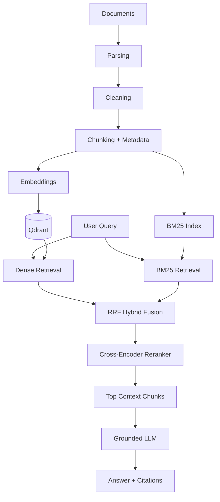

# Enterprise Hybrid RAG Knowledge Assistant

A technically rigorous Retrieval-Augmented Generation system that combines **dense vector search**, **BM25 lexical retrieval**, **Reciprocal Rank Fusion**, and **cross-encoder reranking** to deliver grounded, citation-backed answers from enterprise documents.

## Overview

This project implements a complete RAG pipeline where users upload documents (PDF, TXT, Markdown), and the system ingests, chunks, embeds, and indexes them. At query time, it retrieves relevant chunks using multiple retrieval strategies, fuses and reranks results, and generates grounded answers with source citations.

The key differentiator is the ability to **compare three retrieval strategies** side-by-side:

| Strategy | Pipeline |
|---|---|
| `vector` | Dense retrieval only (Qdrant cosine similarity) |
| `hybrid` | Dense + BM25 → Reciprocal Rank Fusion |
| `hybrid_rerank` | Dense + BM25 → RRF → Cross-encoder reranking |

## Key Features

- **Document Ingestion** — PDF (page-by-page), TXT, and Markdown parsing with metadata preservation
- **Overlapping Chunking** — RecursiveCharacterTextSplitter with configurable size/overlap (character-based, default ~500 chars)
- **Dense Retrieval** — Sentence-transformer embeddings (`BAAI/bge-small-en-v1.5`) stored in Qdrant with cosine similarity
- **BM25 Lexical Retrieval** — BM25Okapi over the same chunk corpus
- **Reciprocal Rank Fusion** — Genuine RRF implementation merging dense + BM25 rankings
- **Cross-Encoder Reranking** — Real cross-encoder model (`cross-encoder/ms-marco-MiniLM-L-6-v2`) rescoring candidates
- **Grounded Generation** — LLM receives only retrieved context with stable [S1], [S2] citation labels
- **Cross-Encoder Citation Alignment** — Inline source labels generated by the LLM are aligned with the most relevant retrieved chunk using the existing cross-encoder, while structured source metadata remains authoritative
- **Retrieval Evaluation** — Hit@K and MRR metrics across all three strategies using a synthetic evaluation corpus
- **Debug Endpoint** — `/retrieve` returns chunks without calling the LLM

## Architecture



## Retrieval Pipeline

### Dense Retrieval
Queries are embedded using `BAAI/bge-small-en-v1.5` and compared against document chunk vectors in Qdrant using cosine similarity. Effective for **paraphrased and semantic queries**.

### BM25 Retrieval
The same chunk corpus is indexed with BM25Okapi. Queries are tokenized and scored lexically. Effective for **exact identifiers, product codes, and technical terms**.

### Reciprocal Rank Fusion (RRF)
Dense and BM25 results are fused using RRF: `score(d) = Σ 1/(k + rank(d))`. This avoids the problem of incomparable raw scores between the two methods.

### Cross-Encoder Reranking
Hybrid candidates (~10-20) are rescored using a cross-encoder (`cross-encoder/ms-marco-MiniLM-L-6-v2`) that jointly evaluates each `(query, chunk)` pair. The top N chunks become the final context.

## Technology Stack

| Component | Technology |
|---|---|
| Backend | Python, FastAPI, Pydantic |
| Embeddings | sentence-transformers (`BAAI/bge-small-en-v1.5`) |
| Vector DB | Qdrant (local persistent storage, cosine similarity) |
| Lexical Search | rank_bm25 (BM25Okapi) |
| Reranker | sentence-transformers CrossEncoder (`cross-encoder/ms-marco-MiniLM-L-6-v2`) |
| LLM | Ollama (local default: `qwen3:8b`) or OpenAI API (configurable) |
| Chunking | LangChain RecursiveCharacterTextSplitter (~500 characters, 80 character overlap) |

## Installation

```bash
# Clone the repository
git clone https://github.com/isha71/enterprise-hybrid-rag-knowledge-assistant.git
cd enterprise-hybrid-rag-knowledge-assistant

# Create virtual environment
python -m venv .venv
source .venv/bin/activate  # macOS/Linux
# .venv\Scripts\activate   # Windows

# Install dependencies
pip install -r requirements.txt
```

## Environment Setup

```bash
cp .env.example .env
```

The default configuration uses **Ollama** with `qwen3:8b` for zero-cost local generation — no API key required. Just ensure Ollama is running:

```bash
ollama pull qwen3:8b
ollama serve
```

To use **OpenAI** instead, edit `.env`:

```env
LLM_PROVIDER=openai
LLM_MODEL=gpt-4o-mini
OPENAI_API_KEY=your_actual_key
```

The retrieval architecture (embeddings, Qdrant, BM25, RRF, reranking) is provider-independent — changing the LLM provider only affects answer generation.

## Run the API

```bash
uvicorn app.main:app --reload
```

The API will be available at `http://localhost:8000`.

## Swagger Documentation

Interactive API docs: [http://localhost:8000/docs](http://localhost:8000/docs)

## API Examples

### Upload Documents

```bash
curl -X POST "http://localhost:8000/api/v1/documents/upload" \
  -F "files=@employee_handbook.pdf" \
  -F "files=@product_manual.pdf"
```

### List Documents

```bash
curl http://localhost:8000/api/v1/documents
```

### Query (Full RAG)

```bash
curl -X POST "http://localhost:8000/api/v1/query" \
  -H "Content-Type: application/json" \
  -d '{
    "question": "What is the refund policy for enterprise subscriptions?",
    "strategy": "hybrid_rerank",
    "top_k": 5
  }'
```

### Retrieve (Debug — No LLM)

```bash
curl -X POST "http://localhost:8000/api/v1/retrieve" \
  -H "Content-Type: application/json" \
  -d '{
    "question": "What is error code E104?",
    "strategy": "hybrid",
    "top_k": 5
  }'
```

## Example RAG Response

**Question:** "What is error code E104 and what happens after the license expires?"

**Strategy:** `hybrid_rerank` (dense + BM25 → RRF → cross-encoder reranking)

**Answer:**

> Error code E104 indicates that the platform license has expired. The platform continues in read-only mode for 7 days after expiration [S1].

**Source:** [S1] product_manual.pdf — Page 5

The retrieval pipeline found the relevant chunk via hybrid search and reranking. The inline citation `[S1]` was aligned against the retrieved source chunk using the cross-encoder before the response was returned.

## Evaluation

The evaluation system compares retrieval quality across all three strategies using a synthetic corpus of two documents (employee_handbook.pdf and product_manual.pdf) with 18 questions spanning semantic, paraphrase, keyword, identifier, and technical-term categories.

### Metrics

- **Hit Rate @ K** — Did a relevant source appear in the top K results? Relevance requires matching document name, page number, AND a specific evidence string present in the chunk text.
- **MRR** (Mean Reciprocal Rank) — Average of 1/rank of the first relevant result

### Run Retrieval Evaluation

```bash
# Generate corpus PDFs, ingest, and evaluate (no LLM required)
python scripts/run_evaluation.py
```

This creates the corpus if missing, ingests the documents, runs all three retrieval strategies, and saves results to `evaluation/results.json`.

Results are generated by running actual retrieval code — no hard-coded scores. The full per-query evaluation snapshot from the latest verified run is available at [`docs/evaluation_results.json`](docs/evaluation_results.json).

### Measured Results

| Strategy | Hit@5 | MRR |
|---|---:|---:|
| Vector | 1.0000 | 0.8444 |
| Hybrid | 1.0000 | 0.8796 |
| Hybrid + Reranking | 0.9444 | 0.8889 |

**Interpretation:** Hybrid retrieval improves MRR from 0.8444 to 0.8796 over vector-only retrieval while maintaining 100% Hit@5, showing the value of combining semantic and lexical signals with Reciprocal Rank Fusion. Cross-encoder reranking increases aggregate MRR slightly further to 0.8889, primarily by improving the ranking of one query (q7), but reduces Hit@5 to 94.44% because it removes the relevant chunk for one technical-term query (q18). This demonstrates that reranking is model- and domain-dependent and should be evaluated empirically rather than assumed to improve every query.

## Project Structure

```
├── app/
│   ├── main.py                 # FastAPI application + lifespan
│   ├── api/routes/             # API endpoint handlers
│   │   ├── health.py           # GET /health
│   │   ├── documents.py        # POST /documents/upload, GET /documents
│   │   ├── query.py            # POST /query, POST /retrieve
│   │   └── evaluation.py       # POST /evaluation/run
│   ├── core/
│   │   ├── config.py           # Pydantic settings from .env
│   │   ├── exceptions.py       # VectorStoreError
│   │   └── logging.py          # Logging setup
│   ├── models/
│   │   ├── schemas.py          # API request/response schemas
│   │   └── domain.py           # Internal data classes (Chunk, RetrievalResult)
│   ├── ingestion/
│   │   ├── loaders.py          # PDF/TXT/MD document parsers
│   │   ├── cleaner.py          # Text cleaning
│   │   ├── chunker.py          # Chunking with metadata preservation
│   │   ├── registry.py         # JSONL chunk persistence
│   │   └── pipeline.py         # End-to-end ingestion orchestration
│   ├── retrieval/
│   │   ├── dense.py            # Embedding model + Qdrant retrieval
│   │   ├── bm25.py             # BM25Okapi retrieval
│   │   ├── hybrid.py           # RRF fusion of dense + BM25
│   │   └── reranker.py         # Cross-encoder reranking
│   ├── vectorstore/
│   │   └── qdrant_store.py     # Qdrant client + operations
│   ├── generation/
│   │   ├── prompts.py          # System prompt + context formatting
│   │   ├── llm.py              # Configurable Ollama / OpenAI generation client
│   │   ├── citations.py        # Cross-encoder citation alignment
│   │   └── rag_pipeline.py     # Full RAG orchestration
│   └── evaluation/
│       ├── metrics.py          # Hit@K, MRR calculations
│       └── evaluator.py        # Strategy comparison runner
├── evaluation/
│   ├── corpus/                 # Synthetic evaluation PDFs (committed)
│   ├── dataset.json            # Evaluation questions with page + evidence-level relevance labels
│   └── results.json            # Generated after running evaluation
├── data/                       # Runtime data (gitignored)
├── tests/                      # Focused unit tests
├── scripts/
│   ├── create_evaluation_corpus.py   # PDF corpus generator
│   └── run_evaluation.py             # End-to-end evaluation runner
├── docs/
│   ├── architecture.md
│   └── evaluation_results.json  # Committed evaluation snapshot
├── .env.example
├── requirements.txt
└── README.md
```

## Limitations

- **Small synthetic evaluation corpus** — Two documents with 18 evaluation questions; designed for demonstrating methodology, not benchmarking
- **BM25 index rebuilt after ingestion** — Acceptable at portfolio scale but would need a persistent lexical index for production
- **Character-based chunking** — Chunk size is measured in characters (Python `len()`), not tokens; ~500 characters ≈ 100-125 tokens depending on content
- **Local portfolio-scale persistence** — Qdrant local storage; designed for tens of documents, not millions
- **No OCR for scanned PDFs** — Only digitally-created PDFs with extractable text are supported
- **No authentication or multi-tenancy** — Single-user, no access control
- **Synchronous CPU-heavy model inference** — Embedding and reranking models run synchronously in FastAPI's threadpool; no distributed inference workers
- **No distributed ingestion workers** — Documents are processed synchronously during upload

## Future Improvements

- Persistent/full-scale lexical search (Elasticsearch)
- Token-aware chunking with embedding model tokenizer
- Authentication and multi-tenancy
- Async ingestion pipeline
- Distributed vector DB deployment
- Query result caching
- Observability and tracing
- Better document parsers (DOCX, tables)
- Query rewriting for improved retrieval
